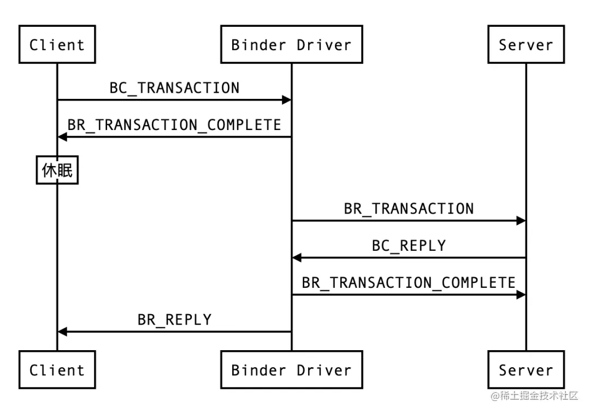
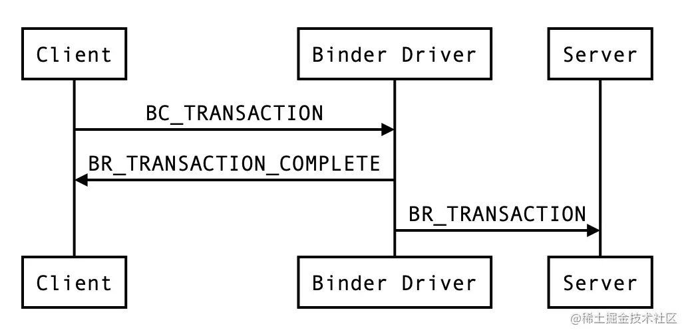

## AIDL 基本使用

官方指导文档：https://developer.android.com/guide/components/aidl?hl=zh-cn

https://blog.csdn.net/m0_50417702/article/details/120452918

## oneway 机制
oneway 主要有两个特性：异步调用和串行化处理。异步调用是指应用向 binder 驱动发送数据后不需要挂起线程等待 binder 驱动的回复，而是直接结束。
像一些系统服务调用应用进程的时候就会使用 oneway，比如 AMS 调用应用进程启动 Activity，这样就算应用进程中做了耗时的任务，也不会阻塞系统服务的运行。
串行化处理是指对于一个服务端的 AIDL 接口而言，所有的 oneway 方法不会同时执行，binder 驱动会将他们串行化处理，排队一个一个调用。

**非 oneway 情况下机制**

**oneway 机制**

涉及到的 binder 命令也有规律，由外部发送给 binder 驱动的都是 BC_ 开头，由 binder 驱动发往外部的都是 BR_开头。这里的客户端挂起
类似于 `Thread.sleep` 方法，是真正的休眠，底层调用的是 `wait_event_interruptible()`  Linux 系统函数。其中在 Handler 机制
的 Looper 阻塞和唤醒的地方，调用的 nativePollOnce() 方法。学习到 Linux 用来实现阻塞/唤醒的 select、poll 和 epoll 机制。